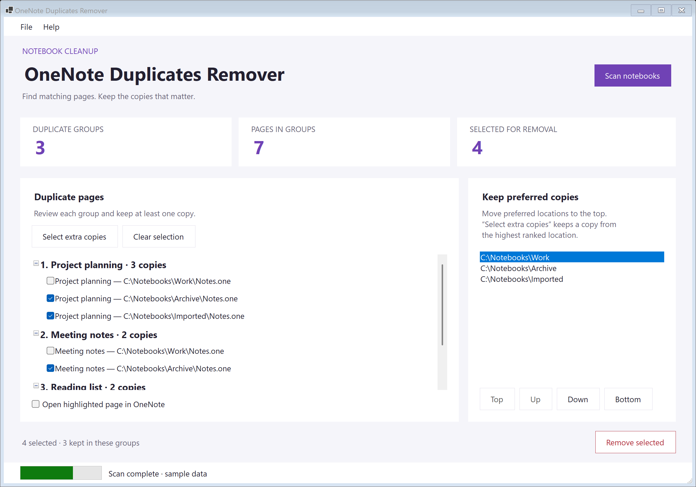

# OneNote Duplicates Remover

A Windows desktop application that identifies and removes duplicate pages in Microsoft OneNote notebooks.

Traditional file-level duplicate removers cannot detect duplicate OneNote pages because they compare file hashes rather than page content. This tool solves that by comparing the actual content of each page using SHA-256 hashing.

## Screenshot



The current interface, shown with sample data. Windows display scaling and high-contrast colors are supported.

## Requirements

- Windows
- Microsoft Office OneNote (desktop version)
- [.NET 10 Desktop Runtime](https://dotnet.microsoft.com/download/dotnet/10.0)

## Download

[setup.exe](https://github.com/relue2718/onenote-duplicates-remover/releases/download/v1.0.1.11/setup.exe) (ClickOnce installer)

## How It Works

1. Connects to OneNote via the COM Interop API
2. Retrieves the full page hierarchy across all notebooks
3. For each page, extracts the content XML and computes a SHA-256 hash of the `InnerText` (ignoring metadata like `objectID` and `lastModifiedTime`)
4. Groups pages with identical hashes as duplicates
5. Displays duplicate groups in a tree view for review and selective removal

### Smart Selection

When selecting duplicates for removal, the tool uses a section preference system that prioritizes keeping pages in cloud-synced notebooks over local ones, and avoids selecting pages from the Recycle Bin. You can also manually select/deselect individual pages.

1. Choose **Scan notebooks** to find matching pages.
2. In **Keep preferred copies**, move the locations you want to keep to the top.
3. Choose **Select extra copies**, then review the checked pages and selection counts.
4. Choose **Remove selected** and confirm. Removal is disabled if every copy in any group is checked.

Group headings show the page title and number of copies. Hover over a heading to inspect its content hash, or over a page to see its full location.

### Removal & Reporting

After removal, an HTML report is generated showing which pages were successfully removed and which could not be removed.

### Help & Diagnostics

**Help → About** shows the app version, process bitness, developer, and license, with links to GitHub, issue reporting, and release history. Choose **Show diagnostics** for Windows, .NET, and OneNote integration details, plus shortcuts to the installation and current log folders. **Copy diagnostics** is available even when OneNote could not initialize; it excludes notebook content and local paths.

[Preview the About dialog](screenshot/about.png).

## Building from Source

Open `OneNoteDuplicatesRemover.sln` in Visual Studio 2026 (with the .NET desktop development workload) and build. The project supports both x86 and x64 configurations.

```
msbuild OneNoteDuplicatesRemover.sln /restore /p:Configuration=Release /p:Platform=x64
```

`dotnet build` is not supported because the COM reference requires the .NET Framework version of MSBuild (MSB4803). Use the `msbuild` bundled with Visual Studio.

### Dependencies

- [Microsoft.Office.Interop.OneNote](https://docs.microsoft.com/en-us/office/client-developer/onenote/onenote-developer-reference) (COM reference, interop types embedded)
- JSON import/export uses the built-in `System.Text.Json`

## Advanced Features

The application includes an Advanced menu (hidden by default) with additional utilities:

- **Export to JSON** - Dump duplicate groups to a JSON file for external processing
- **Clean up using JSON** - Remove pages listed in a previously exported JSON file (useful for batch operations across machines)
- **Flatten Sections** - Merge all sections into a single section named `MERGED_ONE`
- **Export Sections/Pages to XML** - Export the raw OneNote hierarchy data to XML files for analysis

## Disclaimer

- **Back up your notebooks before removing any pages.**
- There is a very small chance of SHA-256 hash collision, where two different pages produce the same hash. This could lead to unexpected data loss.

## Potential Issues


Do not run this program on multiple computers simultaneously. For example, if computers A and B both run this tool and delete different copies of the same page, the sync process may delete all copies, resulting in data loss.
